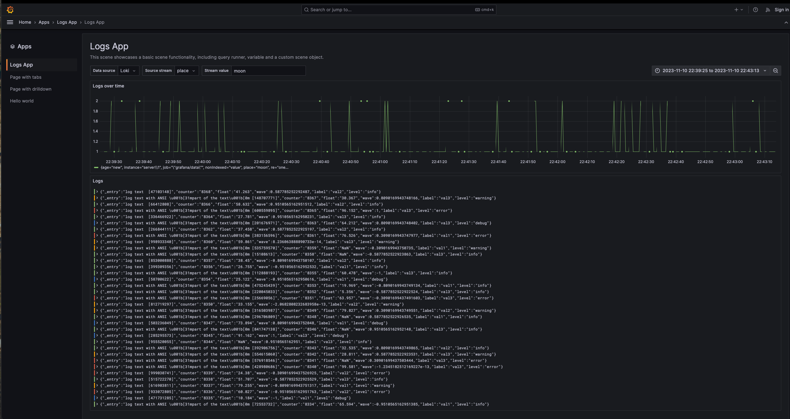

# Grafana Scenes App Plugin Template



### Frontend

1. Install dependencies

   ```bash
   npm install
   ```

2. Build plugin in development mode and run in watch mode

   ```bash
   npm run dev
   ```

3. Build plugin in production mode

   ```bash
   npm run build
   ```

4. Run the tests (using Jest)

   ```bash
   # Runs the tests and watches for changes, requires git init first
   npm run test

   # Exits after running all the tests
   npm run test:ci
   ```

5. Spin up a Grafana instance and run the plugin inside it (using Docker)

   ```bash
   npm run server
   ```

6. Run the E2E tests (using Cypress)

   ```bash
   # Spins up a Grafana instance first that we tests against
   npm run server

   # Starts the tests
   npm run e2e
   ```

7. Run the linter

   ```bash
   npm run lint

   # or

   npm run lint:fix
   ```
